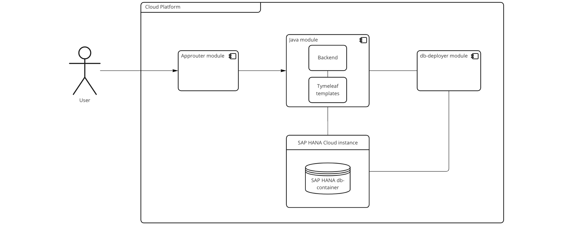

# sap_btp_complimaker

## Prerequisites
Ensure that you have setup a development environment as described [here](.docs/prerequisites.md)

## Build the application
* Clone the project
* Navigate to root of the project (folder with mta.yaml file)
* Execute `mbt build`
> The result should appear in *mta_archives* folder

## Setup BTP account
* Create the trial account [BTP trial](https://cockpit.hanatrial.ondemand.com/trial)
* Navigate to space `dev` and go to `SAP HANA Cloud`
* Create the database instance

> Note: trial SAP HANA Cloud instance stops every day. To start it go to `Manage SAP HANA Cloud` 

## Deploy to Cloud Foundry
* Login to the space from terminal using `cf login`
* Insert API-endpoint from BTP
* Insert email and password
* Execute the command: `cf deploy mta_archives/complimaker-application_1.0.0.mtar`

## Check the application
* Go to the `Applications` in left navigation bar
* Select *complimaker_approuter*
* Follow the link in the top section

## Overview
Application consists of 3 modules and 2 services:
* The application router is the single point-of-entry for an application running in the Cloud Foundry environment on SAP BTP. The application router is used to serve static content, authenticate users, rewrite URLs, and forward or proxy requests to other micro services while propagating user information.
* Java module consists of Spring-boot application and Thymeleaf templates. The project is built using maven and results are packaging to .jar archive.
* DB-deployer application. The SAP HANA Deployment Infrastructure (HDI) provides a service that enables you to deploy database development artifacts to so-called containers. Works once and stops after deployment.
* SAP HANA Cloud allows you to consume the SAP HANA database from applications running on SAP BPT.
* SAP HANA db-container stores the data of the desired schema.

