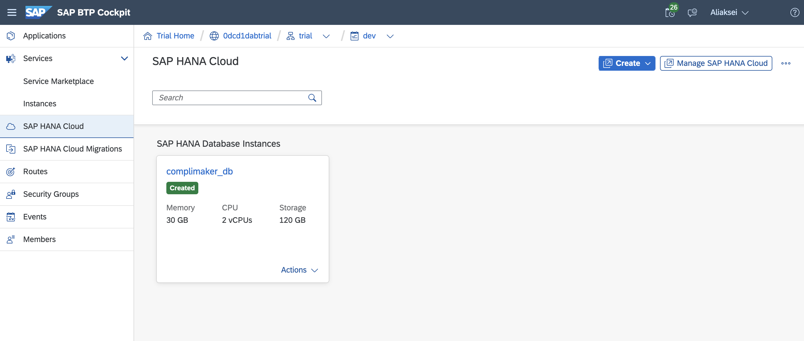
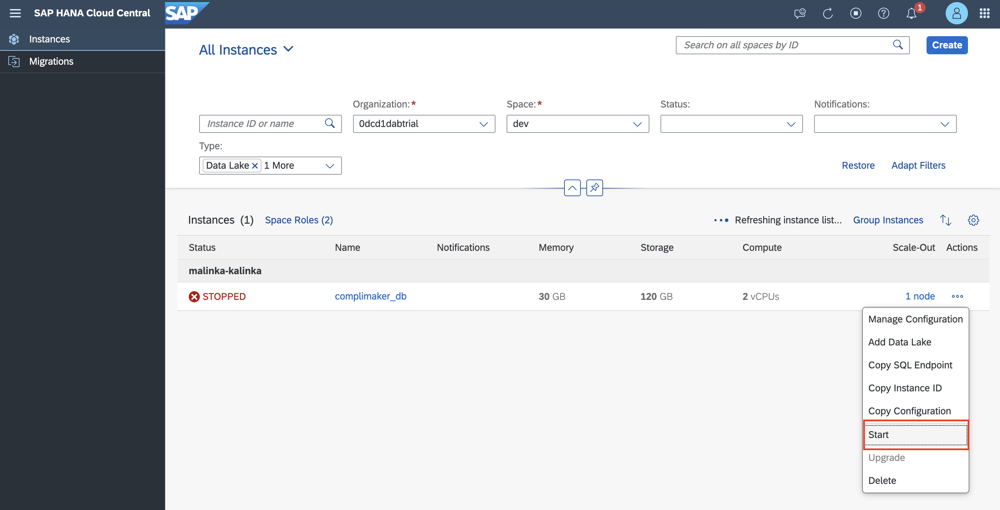
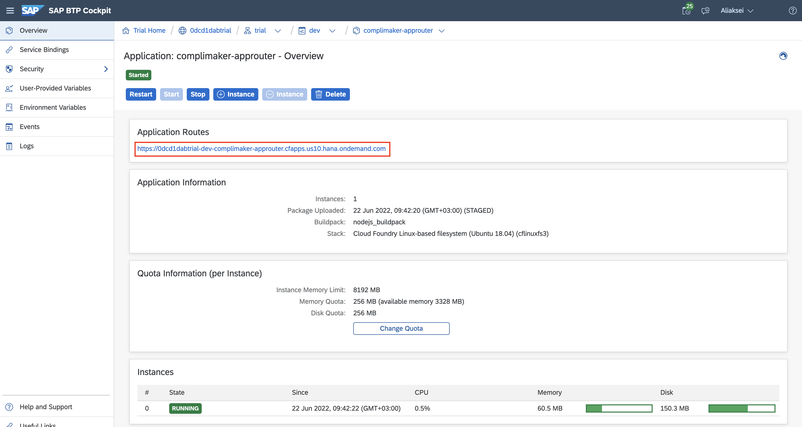

# sap_btp_complimaker

## Prerequisites
Ensure that you have setup a development environment as described [here](.docs/prerequisites.md)

## Build the application
* Clone the project
* Navigate to root of the project (folder with mta.yaml file)
* Execute `mbt build`
> The result should appear in *mta_archives* folder

## Setup BTP account
* Create the trial account [BTP trial](https://cockpit.hanatrial.ondemand.com/trial)
* Navigate to space `dev` and go to `SAP HANA Cloud`
* Create the database instance

> Note: trial SAP HANA Cloud instance stops every day. To start it go to `Manage SAP HANA Cloud` 

## Deploy to Cloud Foundry
* Login to the space from terminal using `cf login`
* Insert API-endpoint from BTP
* Insert email and password
* Execute the command: `cf deploy mta_archives/complimaker-application_1.0.0.mtar`

## Check the application
* Go to the `Applications` in left navigation bar
* Select *complimaker_srv*
* Follow the lonk in the top section
* 
